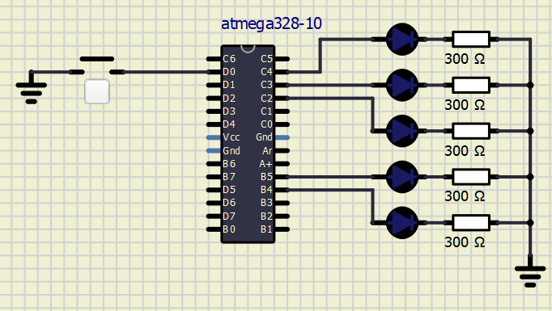

# Lab 2: Ivo Točený

Link to your `Digital-electronics-2` GitHub repository:

   [https://github.com/Ivo-Toceny-222683/Digital-electronics-2/tree/main/Labs/02-leds](https://github.com/Ivo-Toceny-222683/Digital-electronics-2/tree/main/Labs/02-leds)


### Active-low and active-high LEDs

1. Complete tables according to the AVR manual.

| **DDRB** | **Description** |
| :-: | :-- |
| 0 | Input pin |
| 1 | Output pin |

| **PORTB** | **Description** |
| :-: | :-- |
| 0 | Output low value |
| 1 | Output high value |

| **DDRB** | **PORTB** | **Direction** | **Internal pull-up resistor** | **Description** |
| :-: | :-: | :-: | :-: | :-- |
| 0 | 0 | input | no | Tri-state, high-impedance |
| 0 | 1 | input | yes | Pxn will source current if ext. pulled low|
| 1 | 0 | output| no | Output Low (Sink)|
| 1 | 1 | output | no | Output High (Source)|

2. Part of the C code listing with syntax highlighting, which blinks alternately with a pair of LEDs; let one LED is connected to port B and the other to port C:

```c
#define LED_GREEN   PB5     // AVR pin where green LED is connected
#define LED_RED   PC4
#define BLINK_DELAY 500

int main(void)
{
    DDRB = DDRB | (1<<LED_GREEN);
    // ...and turn LED off in Data Register
    PORTB = PORTB & ~(1<<LED_GREEN);

    // Configure the second LED at port C
    DDRC = DDRC | (1<<LED_RED);
    PORTC = PORTC | (1<<LED_RED);

    // Infinite loop
    while (1)
    {
        // Pause several milliseconds
        _delay_ms(BLINK_DELAY);

	PORTB = PORTB ^ (1<<LED_GREEN);
        PORTC = PORTC ^ (1<<LED_RED);
    }

    // Will never reach this
    return 0;
}
```


### Push button

1. Part of the C code listing with syntax highlighting, which toggles LEDs only if push button is pressed. Otherwise, the value of the LEDs does not change. Let the push button is connected to port D:

```c
#define LED_GREEN   PB5     // AVR pin where green LED is connected
#define LED_RED   PC4
#define BUTTON    PD6
#define BLINK_DELAY 500

    // Configure Push button at port D and enable internal pull-up resistor
    // WRITE YOUR CODE HERE

    // Infinite loop
    while (1)
    {
        if(bit_is_clear(PIND, BUTTON))    
        {
            PORTB = PORTB ^ (1<<LED_GREEN);
            PORTC = PORTC ^ (1<<LED_RED);
            loop_until_bit_is_set(PIND, BUTTON);
        }
    }
```


### Knight Rider

1. Scheme of Knight Rider application, i.e. connection of AVR device, five LEDs, resistors, one push button, and supply voltage. The image can be drawn on a computer or by hand. Always name all components and their values!

   

## Functioning code of Knight Rider

```c
#define LED_0   PC4
#define LED_1   PC3 
#define LED_2   PC2 
#define LED_3   PB5 
#define LED_4   PB4 
#define BUTTON    PD0
#define BLINK_DELAY 200

int main(void)
{
    // Green LED at port B
    // Set pin as output in Data Direction Register...
    DDRC = DDRC | (1<<LED_0);
    PORTC = PORTC & ~(1<<LED_0);

    DDRC = DDRC | (1<<LED_1);
    PORTC = PORTC  & ~(1<<LED_1);
	
    DDRC = DDRC | (1<<LED_2);
    PORTC = PORTC & ~(1<<LED_2);
	
    DDRB = DDRB | (1<<LED_3);
    PORTB = PORTB & ~(1<<LED_3);
	
    DDRB = DDRB | (1<<LED_4);
    PORTB = PORTB & ~(1<<LED_4);
    
    // Configure Push button at port D and enable internal pull-up resistor
    DDRD = DDRD & ~(1<<BUTTON);
    PORTD = PORTD | (1<<BUTTON);
    
    int counter = 0;
    bool appSwitch = false;
    bool isAddingDirection = false;
	
    // Infinite loop
    while (1)
    {      	
        if(bit_is_clear(PIND, BUTTON))    
        {
		appSwitch = !appSwitch;
		loop_until_bit_is_set(PIND, BUTTON);

		if(counter > 2)
		{
			PORTB = PORTB ^ (1<<counter);
		}
		else
		{
			PORTC = PORTC ^ (1<<counter);
		}
        }
		
	if(appSwitch)
	{		
		switch (counter)
		{
			case 0:
				PORTB = PORTB ^ (1<<LED_1);
				PORTC = PORTC ^ (1<<LED_0);
				isAddingDirection = true;
				break;
			case 1:
				if(isAddingDirection)
				{
					PORTC = PORTC ^ (1<<LED_0);
					PORTC = PORTC ^ (1<<LED_1);
				}
				else
				{
					PORTC = PORTC ^ (1<<LED_2);
					PORTC = PORTC ^ (1<<LED_1);
				}
				break;
			case 2:
				if(isAddingDirection)
				{
					PORTC = PORTC ^ (1<<LED_1);
					PORTC = PORTC ^ (1<<LED_2);
				}
				else
				{
					PORTB = PORTB ^ (1<<LED_3);
					PORTC = PORTC ^ (1<<LED_2);
				}
				break;
			case 3:
				if(isAddingDirection)
				{
					PORTC = PORTC ^ (1<<LED_2);
					PORTB = PORTB ^ (1<<LED_3);
				}
				else
				{
					PORTB = PORTB ^ (1<<LED_4);
					PORTB = PORTB ^ (1<<LED_3);
				}
				break;
			case 4:
				PORTB = PORTB ^ (1<<LED_3);
				PORTB = PORTB ^ (1<<LED_4);
				isAddingDirection = false;
				break;
		}
						
		isAddingDirection ? counter++ : counter--;
		_delay_ms(BLINK_DELAY);
	}
    }

    // Will never reach this
    return 0;
}
```