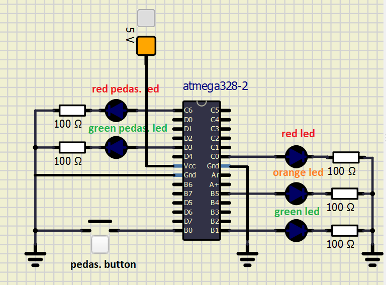

# Lab 3: Ivo Točený

Link to your `Digital-electronics-2` GitHub repository:

   [https://github.com/Ivo-Toceny-222683/Digital-electronics-2/tree/main/Labs/03-gpio](https://github.com/Ivo-Toceny-222683/Digital-electronics-2/tree/main/Labs/03-gpio)


### Data types in C

1. Complete table.

| **Data type** | **Number of bits** | **Range** | **Description** |
| :-: | :-: | :-: | :-- | 
| `uint8_t`  | 8 | 0, 1, ..., 255 | Unsigned 8-bit integer |
| `int8_t`   | 8 | -128, ..., 127 | Signed 8-bit integer |
| `uint16_t` | 16 | 0, ..., 65 535 | Unsigned 16-bit integer |
| `int16_t`  | 16 | -32 768, ..., 32 767 | Signed 16-bit integer |
| `float`    | 32 | -3.4e+38, ..., 3.4e+38 | Single-precision floating-point |
| `void`     | 0 | - | Empty data type, cant have any size |


### GPIO library

1. In your words, describe the difference between the declaration and the definition of the function in C.
   * Function declaration - used in header files (.h) to tell compiler something like this function/variable/class exist with this type.
			    In short, Its function, but without its body. 
   * Function definition - Body of that function is DEFINED in .c files, where the complete, for example, function is.

2. Part of the C code listing with syntax highlighting, which toggles LEDs only if push button is pressed. Otherwise, the value of the LEDs does not change. Use function from your GPIO library. Let the push button is connected to port D:

```c
    // Configure Push button at port D and enable internal pull-up resistor
    // WRITE YOUR CODE HERE
    
    // Green LED at port B
    GPIO_config_output(&DDRB, LED_GREEN);
    GPIO_write_low(&PORTB, LED_GREEN);

    // Configure the second LED at port C
    GPIO_config_output(&DDRC, LED_RED);
    GPIO_write_high(&PORTC, LED_RED);
    
    // Configure Push button at port D and enable internal pull-up resistor
    GPIO_config_input_pullup(&DDRD, BUTTON);

    // Infinite loop
    while (1)
    {
        // WRITE YOUR CODE HERE
        if((bit_is_clear(&PIND, BUTTON))
        {
            GPIO_toggle(&PORTB, LED_GREEN);
            GPIO_toggle(&PORTC, LED_RED);
            loop_until_bit_is_set(&PIND, BUTTON);
        }
    }
```


### Traffic light

1. Scheme of traffic light application with one red/yellow/green light for cars and one red/green light for pedestrians. Connect AVR device, LEDs, resistors, one push button (for pedestrians), and supply voltage. The image can be drawn on a computer or by hand. Always name all components and their values!

   