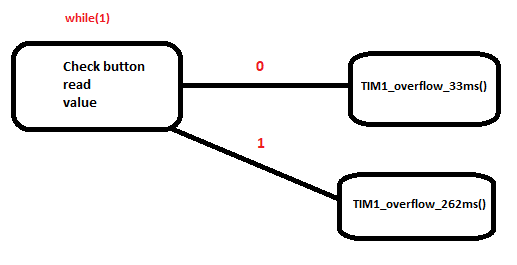

# Lab 4: YOUR_FIRSTNAME FAMILYNAME

Link to your `Digital-electronics-2` GitHub repository:

   [https://github.com/Ivo-Toceny-222683/Digital-electronics-2/tree/main/Labs/04-interrupts](https://github.com/Ivo-Toceny-222683/Digital-electronics-2/tree/main/Labs/04-interrupts)


### Overflow times

1. Complete table with overflow times.

| **Module** | **Number of bits** | **1** | **8** | **32** | **64** | **128** | **256** | **1024** |
| :-: | :-: | :-: | :-: | :-: | :-: | :-: | :-: | :-: |
| Timer/Counter0 | 8  | 16u | 128u | -- | 1m | -- | 4m | 16m |
| Timer/Counter1 | 16 | 4m | 32m | -- | 0,262 | -- | 1,049 | 4,194 |
| Timer/Counter2 | 8  | 16u | 128u | 0,512m | 1m | 2m | 4m | 16m |


### Timer library

1. In your words, describe the difference between common C function and interrupt service routine.
   * Function - Može byť volaná v niekedy v priebehu funkcie main(), vykoná sa jedine ak je zavolaná mainom, nemá žiadnu prioritu narozdiel od iterruptu
   * Interrupt service routine - Nie je špecificky volaná v maine, nastane pri vyvolaní interruptu, či už hardwarovo(tlačítko) alebo softwarovo(naprogramovaný, povedzme pri pretečení čítaču), ak nastane, automaticky sa preruší akákoľvek iná funkcia sa vykonáva a vykoná sa vnútro tohto ISR, následne sa vráti program spatne do mainu.

2. Part of the header file listing with syntax highlighting, which defines settings for Timer/Counter0:

```c
/**
 * @name  Definitions of Timer/Counter0
 * @note  F_CPU = 16 MHz
 */
// WRITE YOUR CODE HERE
```

3. Flowchart figure for function `main()` and interrupt service routine `ISR(TIMER1_OVF_vect)` of application that ensures the flashing of one LED in the timer interruption. When the button is pressed, the blinking is faster, when the button is released, it is slower. Use only a timer overflow and not a delay library.

```c
/**
 * @name  Definitions of Timer/Counter0
 * @note  F_CPU = 16 MHz
 */
int main(void)
{
    // Configuration of LED(s) at port B
    GPIO_config_output(&DDRB, LED_D1);
    GPIO_write_low(&PORTB, LED_D1);

    // Configuration of 16-bit Timer/Counter1 for LED blinking
    // Set the overflow prescaler to 262 ms and enable interrupt
    TIM1_overflow_262ms();
    TIM1_overflow_interrupt_enable();

    // Enables interrupts by setting the global interrupt mask
    sei();

    // Infinite loop
    while (1)
    {
        if(!GPIO_read(&PINC, BUTTON_PC1))
        {
            TIM1_overflow_33ms();
        }
        else
        {
            TIM1_overflow_262ms();
        }
    }

    // Will never reach this
    return 0;
}

ISR(TIMER1_OVF_vect)
{
    GPIO_toggle(&PORTB, LED_D1);
}
```




### Knight Rider

1. Scheme of Knight Rider application with four LEDs and a push button, connected according to Multi-function shield. Connect AVR device, LEDs, resistors, push button, and supply voltage. The image can be drawn on a computer or by hand. Always name all components and their values!

   