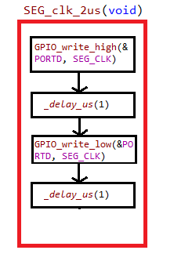
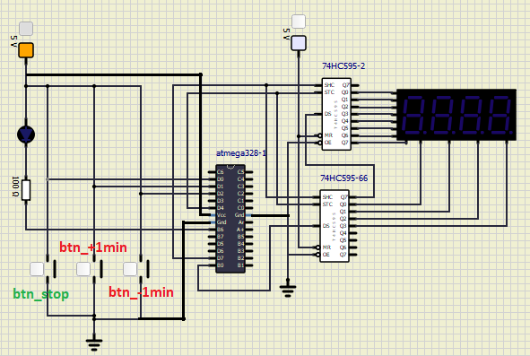

# Lab 5: Ivo Točený

Link to your `Digital-electronics-2` GitHub repository:

   [https://github.com/Ivo-Toceny-222683/Digital-electronics-2/tree/main/Labs/05-segment](https://github.com/Ivo-Toceny-222683/Digital-electronics-2/tree/main/Labs/05-segment)


### 7-segment library

1. In your words, describe the difference between Common Cathode and Common Anode 7-segment display.
   * CC SSD - This is totally opposite to CA SSD, so here the cathodes of LEDs are all connected together and they are grounded and we light up specific LED by connecting them to power supply.
   * CA SSD - All LEDs are connected together by their Anodes sides. Power supply is connected to circuit on anodes, so all connected anodes share the power supply and we can then connect ground on the other side of LEDs to specific LEDs to make them light up.

2. Code listing with syntax highlighting of two interrupt service routines (`TIMER1_OVF_vect`, `TIMER0_OVF_vect`) from counter application with at least two digits, ie. values from 00 to 59:

```c
/**********************************************************************
 * Function: Timer/Counter1 overflow interrupt
 * Purpose:  Increment counter value from 00 to 59.
 **********************************************************************/
ISR(TIMER1_OVF_vect)
{
    if(counter < 60)
    {
	counter++;
    }
    else
    {
	counter = 0;
    }
}
```

```c
/**********************************************************************
 * Function: Timer/Counter0 overflow interrupt
 * Purpose:  Display tens and units of a counter at SSD.
 **********************************************************************/
ISR(TIMER0_OVF_vect)
{
    static uint8_t pos = 0;  // This line will only run the first time
	static uint8_t currentVal;
    static int pow10[5] = { 1, 10, 100, 1000, 10000 };
    
    // calculate digit from number and pos
    currentVal = (counter % pow10[pos+1]) / (pow10[pos]);
    
    // Update segment
    SEG_update_shift_regs(currentVal, pos);
    
    // Increment to go to next segment
    pos++;
	
    if (pos == 4)
    {
	pos = 0;
    }
}
```

3. Flowchart figure for function `SEG_clk_2us()` which generates one clock period on `SEG_CLK` pin with a duration of 2&nbsp;us. The image can be drawn on a computer or by hand. Use clear descriptions of the individual steps of the algorithms.

   


### Kitchen alarm

Consider a kitchen alarm with a 7-segment display, one LED and three push buttons: start, +1 minute, -1 minute. Use the +1/-1 minute buttons to increment/decrement the timer value. After pressing the Start button, the countdown starts. The countdown value is shown on the display in the form of mm.ss (minutes.seconds). At the end of the countdown, the LED will start blinking.

1. Scheme of kitchen alarm; do not forget the supply voltage. The image can be drawn on a computer or by hand. Always name all components and their values.

   